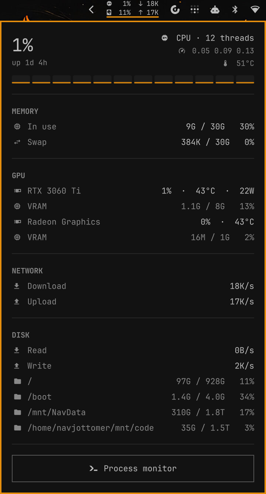

# Omarchy System Monitor

CPU, memory, GPU, disk and network at a glance in the Omarchy bar. A compact
two-row label lives in the bar; click it for the full breakdown.

<p align="center"></p>

## Features

- **Bar label.** CPU load and root-disk use on the left, download and upload
  rates on the right, in a two-row block the size of one bar slot.
- **Panel breakdown.**
  - **CPU:** total load, per-core bars, load average, temperature, uptime
  - **Memory:** RAM and swap in use
  - **GPU:** load, temperature, power and VRAM for NVIDIA and AMD cards,
    including integrated Radeon graphics
  - **Network:** download and upload, per interface when more than one is up
  - **Disk:** read and write rates, space used per filesystem
- **Busy cores and GPUs turn red** above 85%, in your theme's urgent colour.
- **One step to btop.** The **Process monitor** button, Enter in the panel, or
  right-clicking the bar label opens btop.
- **Follows your theme.** Built from the stock Omarchy panel parts.
- **Close to free.** The data script reads `/proc` and `/sys` without starting
  new processes each tick; about 10 ms of CPU every 12 seconds.

## Requirements

- [Omarchy](https://omarchy.org) with the Quickshell-based Omarchy shell
- `bash`, `coreutils`, `gawk` (present on every Omarchy install)
- Optional: `nvidia-utils` for NVIDIA GPU stats (`nvidia-smi`). AMD GPUs need
  nothing extra. Intel GPUs are not shown.
- Optional: `btop` for the **Process monitor** button (ships with Omarchy)

## Install

```sh
omarchy plugin add https://github.com/navjottomer/omarchy-sysmon.git --enable
```

This clones the plugin into `~/.config/omarchy/plugins/navjottomer.sysmon/`,
validates it and puts it on the bar.

## Update

```sh
omarchy plugin update navjottomer.sysmon
```

## Remove

```sh
omarchy plugin remove navjottomer.sysmon
```

Nothing else is left behind.

## Usage

| Action | Result |
|---|---|
| click the bar label | open or close the panel |
| right-click the bar label | open btop |
| Enter in the panel | open btop |
| Tab / Shift+Tab | switch to the next bar panel |
| Esc | close |

## How it works

`bin/omarchy-bar-sysmon` is one long-lived Bash process. Every 2 seconds it
prints one JSON line with a ready-made bar label and the raw numbers; the
panel formats and lays them out.

- **CPU, memory, network, disk I/O, AMD GPUs** come from `/proc` and `/sys`,
  read with Bash built-ins. A normal tick starts no new process.
- **Disk space** comes from `df`, run every 15th tick (about every 30 s).
- **NVIDIA GPUs** have no `/sys` counters, so one `nvidia-smi` runs alongside
  in its own loop mode (about 27 MB, near-zero CPU). The script reads its
  newest line each tick, and stops it on exit.
- **No double counting.** VPN, container and bridge interfaces are
  skipped so traffic is not counted twice; only whole disks count toward I/O.

- **Bounded records.** At most 16 mounts, 16 interfaces and 8 GPUs, names
  clipped to 64 characters, and each record capped at 32 KB (lists are
  dropped from a record that would exceed it). All system-supplied text is
  shown as plain text, never as markup.

While the panel is closed, a tick costs the shell a single property write;
the detail rows update only while the panel is open.

## Development notes

- `Panel.qml` is the whole widget. It extends `qs.Ui/Panel`, which is what
  makes the bar paint its accent open-panel mark under it — a plain bar module
  cannot get that mark by styling alone.
- Glyphs are supplementary-plane (U+F0000+). Write them with `chr(0x…)` from a
  script; pasting them through a shell heredoc can split them and give tofu.
- The label is two rows in a 26 px slot. `verticalCenterOffset` lifts it clear
  of the open-panel mark painted over the bottom 4 px.
- If an edit does not show up, run `omarchy restart shell`.

## License

[MIT](LICENSE)
